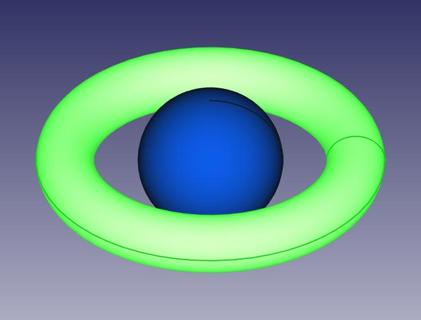

# Text to CAD
## Description
This repository is a text to CAD generator for 3D primitive shapes.
It uses a self-trained AI model to decode the primitive shape and parameters from a text input.
Then, it generates a 3D CAD file, containing the shape specified as text.

The following packages are contained in this module:

### Training Data Generation
Generates training data correlating text to primitive shape and the required parameters to build that shape.

### Model Generation
Using the training data, it generates a model that can decode text (i.e. a sentence contaning a primitive shape and qualitative of quantitative measures) into a primitive shape and its parameters. The approach is a supervised learning algorithm, using Adam as an optimizer and MSE as criterion.

### Generative CAD
Generates a Freecad file, containing one or more primitive shapes.

### Text to CAD
This module takes in as an input a text sequence (or sentence) and will output a 3D CAD file, containing the primitve shape contained in the text sequence.
At the moment, only one shape can be generated at a time, although the Generative CAD module supports generating multiple shapes with different positions and orientations.

### Text to CAD common
Library containing common functions.

## Usage Instructions

## Generate training data
In order to generate training data, you can use the scripts in `training_data_generation`.
Each script will generate data for a different shape. Once you have generated all the shapes you are interested in, store them in a `datasets` directory.

Example:
```
python3 /usr/bin/generate_sphere_data.py --num-datapoints 1000000
```
The command above will generate training data for the primitive shape: sphere.

## Train a new model
In order to train and generate the model, you can run the script under `model_generation`. The model will be stored under the `model.pth` file.
This script will also generate other files, such are `config.yaml` and `vectorizer.pkl`, which will also be needed when calling the `run_text_to_cad.py` script.
```
python3 /usr/bin/train_model.py --datasets-dir path_to_datasets_dir
```

Use the flag `--retrain` and indicate the model file, if you wish to retrain a model:
```
python3 /usr/bin/train_model.py --datasets-dir path_to_datasets_dir --retrain --model-file model.pth
```

In order to check all configurable parameters, run:
```
python3 /usr/bin/train_model.py --help
```

Training a new model is very resource consuming. Depending on the capabilities of your computer, you should choose from different strategies:
- Train with less data.
- Train only with the primitive shapes you need.
- Re-train the model several times.

## Run text_to_cad
Once the model is generated, you can start using it! Here is an example:

```
python3 /usr/bin/run_text_to_cad.py --text-input "A large sphere" --output-file "output_cad.FCStd" --model-file model.pth --config-file config.yaml --vectorizer-file vectorizer.pkl
```

In order to check all configurable parameters, run:
```
python3 /usr/bin/run_text_to_cad.py --help
```
Once the freecad file opens in Freecad, go to the menu _View --> Visibility --> Show all objects_.

## Standalone FreeCAD shape generator
The package `generative_cad` can be used in standalone mode in order to generate a CAD model with one or more primitive shapes.
Please refer to the example in `generative_cad/scripts/example_generate_freecad_shape.py`

```
python3 /usr/bin/example_generate_freecad_shape.py
```



## Installation
### Prerequisites
- pytorch
- freecad

### Installation Instructions
All required packages can be built and installed by executing the `install.sh` script.
After installation, some new files will be created inside the packages. In order to delete these files, you can execute the `clean.sh` script.

### Uninstallation Instructions
In order to uninstall the packages, you can execute the `uninstall.sh` script.
Please keep in mind that this script shall be executed before `clean.sh`.

### Troubleshooting
#### FreeCAD
Before troubleshooting, ensure you've installed FreeCAD correctly. Refer to the official FreeCAD documentation or follow the instructions provided online to install FreeCAD on your system.

If you are still experiencing issues with FreeCAD after installation, follow these steps to troubleshoot and resolve common problems.

1. **Check FreeCAD Installation**: Confirm that FreeCAD is installed properly and accessible from your Python environment.

2. **Verify Module Import**: Ensure that you're importing the `FreeCAD` module correctly in your Python scripts or environments.

    ```python3
    import FreeCAD
    ```

3. **Additional Commands**

If you're still encountering issues, try running the following commands in a terminal:

```bash
sudo scp -r /usr/lib/freecad/Mod/ /usr/lib/freecad-python3/
sudo scp -r /usr/lib/freecad/Gui/ /usr/lib/freecad-python3/
sudo scp -r /usr/lib/freecad/Ext/ /usr/lib/freecad-python3/
sudo scp -r /usr/lib/freecad/bin/ /usr/lib/freecad-python3/
sudo scp -r /usr/lib/freecad/lib/ /usr/lib/freecad-python3/
```
